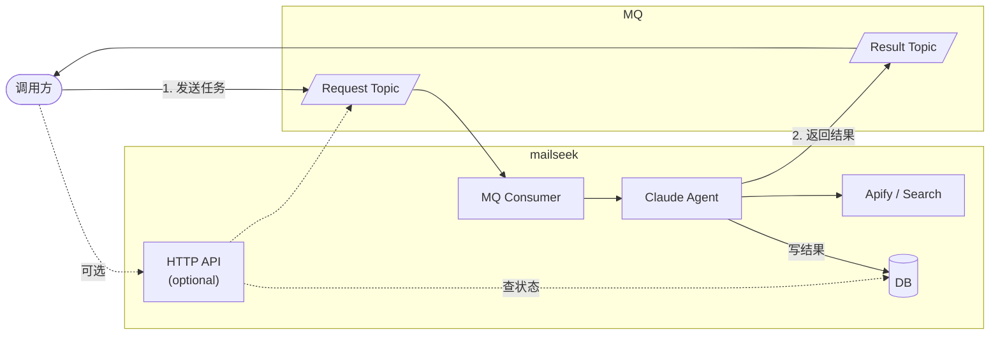

# mailseek - 创作者邮箱发现 Agent

独立 Python 服务，使用 Claude Agent SDK 发现创作者邮箱。

## 架构



## API 设计

### POST /submit

提交单个邮箱发现任务。

**Request**
```json
{
  "url": "https://youtube.com/@MrBeast",
  "platform": "youtube"  // youtube | tiktok | instagram
}
```

**Response**
```json
{
  "task_id": "abc123"
}
```

---

### GET /task/:task_id

查询任务状态。

**Response**

| status | 说明 | emails |
|--------|------|--------|
| `pending` | 排队中 | - |
| `processing` | 处理中 | - |
| `succeeded` | 成功 | 邮箱列表 |
| `failed` | 失败 | - |

```json
// 成功
{
  "task_id": "abc123",
  "status": "succeeded",
  "emails": ["business@example.com", "contact@example.com"]
}

// 失败
{
  "task_id": "abc123",
  "status": "failed",
  "error": "Invalid URL format"
}
```

---

### POST /batch

批量提交任务（上限 100）。

**Request**
```json
{
  "tasks": [
    {"url": "https://youtube.com/@MrBeast", "platform": "youtube"},
    {"url": "https://tiktok.com/@charlidamelio", "platform": "tiktok"}
  ]
}
```

**Response**
```json
{
  "task_ids": ["abc123", "def456"]
}
```

## MQ 消息

```json
// request topic
{"task_id": "xxx", "platform": "youtube", "url": "https://..."}

// result topic
{"task_id": "xxx", "status": "succeeded", "emails": ["..."]}
```

## 项目结构

```
mailseek/
├── src/
│   └── mailseek/
│       ├── __init__.py
│       ├── agent.py         # Claude Agent 核心
│       ├── server.py        # HTTP API (FastAPI)
│       ├── consumer.py      # MQ 消费者
│       ├── repository.py    # DB 操作
│       ├── mq.py            # MQ 客户端
│       ├── config.py        # 配置
│       └── tools/
│           ├── __init__.py
│           ├── apify.py     # Apify 爬虫
│           └── search.py    # Web 搜索
├── tests/
├── pyproject.toml
├── .env.example
└── README.md
```

## 启动命令

```bash
# MQ 消费者
python -m mailseek consume

# HTTP 服务 (可选)
python -m mailseek serve --port 8000
```

## 依赖

```
claude-agent-sdk
fastapi
uvicorn
rocketmq-client-python
httpx
sqlalchemy
python-dotenv
```

## 环境变量

```
ANTHROPIC_API_KEY=
APIFY_API_KEY=
ROCKETMQ_ENDPOINT=
ROCKETMQ_ACCESS_KEY=
ROCKETMQ_SECRET_KEY=
ROCKETMQ_TOPIC_REQUEST=
ROCKETMQ_TOPIC_RESULT=
DATABASE_URL=
```
